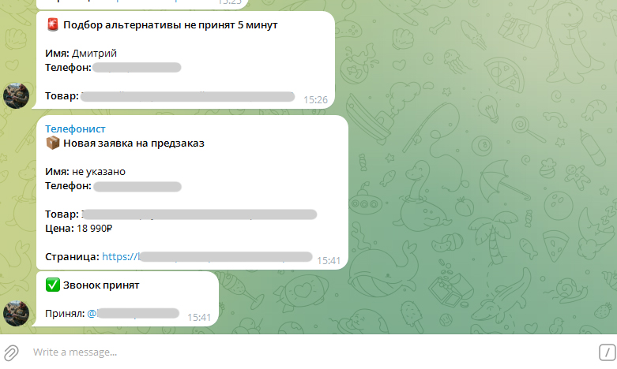

# Serverless website leads to Telegram with Yandex Cloud

A simple serverless system for sending website leads to Telegram without Make, n8n, Zapier, or other external webhook services.

The project receives leads from a website, sends them to a Telegram chat, adds an inline **Accept** button, saves the lead status in YDB, and sends a reminder after 5 minutes if nobody accepted the lead.

For small and medium projects this setup is usually free or very cheap, because it uses serverless functions, a small database table, and a message queue.

It can be useful for ecommerce stores, landing pages, service websites, and any form where you do not want to lose a customer request.

---

## What it does

- Receives leads from a website by HTTP request.
- Sends lead notifications to Telegram.
- Adds an inline **Accept** button.
- Saves the lead in YDB with `pending` status.
- Changes the status to `accepted` when a manager clicks the button.
- Shows who accepted the lead.
- Sends a reminder after 5 minutes if nobody accepted the lead.
- Supports different lead types with different Telegram messages.

---

## Supported lead types

There are 4 lead types included:

| Lead type | Description | Telegram button | Reminder |
|---|---|---|---|
| `callback_request` | Callback request | `✅ Accept callback` | `🚨 Callback was not accepted for 5 minutes` |
| `one_click_order` | One-click order | `✅ Accept order` | `🚨 One-click order was not accepted for 5 minutes` |
| `preorder_request` | Product preorder | `✅ Accept preorder` | `🚨 Preorder was not accepted for 5 minutes` |
| `alternative_request` | Alternative product request | `✅ Accept alternative request` | `🚨 Alternative request was not accepted for 5 minutes` |



---

## Estimated cost

For small traffic this setup usually fits into free limits.

For one lead, the system uses roughly:

- 1 call to `create-request` function;
- 1 Telegram message;
- 1 write to YDB;
- 1 message to Message Queue;
- 1 call to `reminder` function after 5 minutes;
- 1 read from YDB;
- sometimes 1 call to `accept-request` when a manager clicks the button;
- 1 update in YDB.

Approximate numbers:

| Leads per month | Function calls | Queue requests | YDB operations | Estimated cost |
|---:|---:|---:|---:|---:|
| 100 | up to 300 | about 100 | a few hundred | usually free |
| 1,000 | up to 3,000 | about 1,000 | a few thousand | usually free |
| 10,000 | up to 30,000 | about 10,000 | tens of thousands | usually free |
| 100,000 | up to 300,000 | about 100,000 | hundreds of thousands | close to free or very cheap |

Why:

- Cloud Functions have a free monthly tier.
- Message Queue has a free monthly tier.
- YDB Serverless has a free monthly tier for small workloads.
- Telegram Bot API is free.

Real cost depends on your region, traffic, function execution time, message size, and current Yandex Cloud pricing.

---

## Architecture

```text
Website
  ↓ POST request
Cloud Function #1: create-request
  ├─→ Telegram: message with “Accept” button
  ├─→ YDB: save lead with pending status
  └─→ Message Queue: request_id with 5 minute delay

Telegram inline button
  ↓ webhook
Cloud Function #2: accept-request
  ├─→ YDB: pending → accepted
  └─→ Telegram: who accepted the lead

Message Queue after 5 minutes
  ↓ trigger
Cloud Function #3: reminder
  ├─→ reads lead from YDB
  ├─→ if status = pending, sends reminder
  └─→ if status = accepted, does nothing
```

---

## Project structure

```text
functions/
  create-request/
    index.js
    package.json

  accept-request/
    index.js
    package.json

  reminder/
    index.js
    package.json

examples/
  frontend-payloads.js

ydb-schema.sql
.env.example
README.md
```

---

## Requirements

You need:

- Yandex Cloud account;
- Telegram bot;
- Telegram group or chat for leads;
- Yandex Cloud Functions;
- YDB Serverless database;
- Yandex Message Queue;
- Message Queue trigger for Cloud Functions.

---

## Quick setup

### 1. Create Telegram bot

1. Open BotFather in Telegram.
2. Create a new bot.
3. Save the bot token.

Example env variable:

```env
TELEGRAM_BOT_TOKEN=1234567890:your_bot_token_here
```

---

### 2. Add bot to Telegram chat

1. Create a Telegram group or use an existing one.
2. Add your bot to this group.
3. Get the group `chat_id`.
4. Add it to environment variables.

```env
TELEGRAM_CHAT_ID=-1001234567890
```

You can also use a separate test chat:

```env
TELEGRAM_CHAT_ID_TEST=-1009876543210
```

---

### 3. Create YDB Serverless database

Create a YDB database in **Serverless** mode.

You will need:

```env
YDB_ENDPOINT=grpcs://ydb.serverless.yandexcloud.net:2135
YDB_DATABASE=/ru-central1/your-cloud-id/your-folder-id/your-database-id
```

---

### 4. Create YDB table

Example schema:

```sql
CREATE TABLE callback_requests (
  request_id Utf8 NOT NULL,
  request_type Utf8,
  status Utf8,
  phone Utf8,
  name Utf8,
  comment Utf8,
  page_url Utf8,
  product_name Utf8,
  product_price Utf8,
  message_id Utf8,
  created_at Utf8,
  accepted_by Utf8,
  accepted_at Utf8,
  PRIMARY KEY (request_id)
);
```

---

### 5. Create Message Queue

Create a standard queue, for example:

```text
callback-reminders
```

Recommended settings:

```text
Type: Standard
Delivery delay: 300 seconds
Message retention period: 4 days
Trigger batch size: 1
```

Save queue URL:

```env
YMQ_QUEUE_URL=https://message-queue.api.cloud.yandex.net/your-folder-id/your-queue-id/callback-reminders
```

---

### 6. Create service account

Create a service account, for example:

```text
lead-router-sa
```

For quick setup you can give it these roles:

```text
functions.functionInvoker
ymq.writer
editor
```

`editor` is the simple way to start and test everything. Later it is better to replace it with more specific roles.

---

### 7. Create static access key

To send messages to Yandex Message Queue through AWS SQS SDK, you need a static access key for your service account.

Add these env variables:

```env
AWS_REGION=ru-central1
AWS_ACCESS_KEY_ID=your_access_key_id
AWS_SECRET_ACCESS_KEY=your_secret_access_key
```

---

## Environment variables

### `create-request`

```env
TELEGRAM_BOT_TOKEN=
TELEGRAM_CHAT_ID=
TELEGRAM_CHAT_ID_TEST=

YDB_ENDPOINT=
YDB_DATABASE=

YMQ_QUEUE_URL=
AWS_REGION=ru-central1
AWS_ACCESS_KEY_ID=
AWS_SECRET_ACCESS_KEY=
```

### `accept-request`

```env
TELEGRAM_BOT_TOKEN=
TELEGRAM_CHAT_ID=
TELEGRAM_CHAT_ID_TEST=

YDB_ENDPOINT=
YDB_DATABASE=
```

### `reminder`

```env
TELEGRAM_BOT_TOKEN=
TELEGRAM_CHAT_ID=
TELEGRAM_CHAT_ID_TEST=

YDB_ENDPOINT=
YDB_DATABASE=
```

---

## Function 1: `create-request`

This function receives leads from the website.

What it does:

1. Checks incoming data.
2. Detects lead type.
3. Sends Telegram message.
4. Saves lead to YDB with `pending` status.
5. Sends `request_id` to Message Queue.

Supported types:

```text
callback_request
one_click_order
preorder_request
alternative_request
```

---

## Function 2: `accept-request`

This function receives Telegram webhook events.

What it does:

1. Gets inline button click.
2. Extracts `request_id`.
3. Finds the lead in YDB.
4. Changes status to `accepted`.
5. Saves who accepted the lead.
6. Removes the button from the original message.
7. Sends a message to the chat.

Example for callback:

```text
✅ Callback accepted

Accepted by: @username
```

Example for order:

```text
✅ Order accepted

Accepted by: @username
```

---

## Function 3: `reminder`

This function is called by Message Queue trigger after 5 minutes.

What it does:

1. Gets `request_id` from queue.
2. Reads the lead from YDB.
3. If `status = accepted`, does nothing.
4. If `status = pending`, sends a reminder to Telegram.

Reminder examples:

```text
🚨 Callback was not accepted for 5 minutes
```

```text
🚨 One-click order was not accepted for 5 minutes
```

```text
🚨 Preorder was not accepted for 5 minutes
```

```text
🚨 Alternative request was not accepted for 5 minutes
```

---

## Telegram webhook setup

After creating the `accept-request` function, you need to connect it to Telegram webhook.

Function URL will look like this:

```text
https://functions.yandexcloud.net/your-function-id
```

Webhook must accept `callback_query`.

Example request:

```text
https://api.telegram.org/bot<TOKEN>/setWebhook?url=https%3A%2F%2Ffunctions.yandexcloud.net%2Fyour-function-id&allowed_updates=%5B%22callback_query%22%5D
```

Check webhook:

```text
https://api.telegram.org/bot<TOKEN>/getWebhookInfo
```

Expected part of response:

```json
{
  "allowed_updates": ["callback_query"]
}
```

---

## Message Queue trigger setup

Create trigger:

```text
Type: Message Queue
Queue: callback-reminders
Resource: Function
Function: reminder
Batch size: 1
Waiting time: 0
```

After creating the trigger, it may take a few minutes before it starts working.

---

## Frontend payload examples

### Callback request

```js
fetch('https://functions.yandexcloud.net/your-create-request-function-id', {
  method: 'POST',
  headers: {
    'Content-Type': 'application/json',
  },
  body: JSON.stringify({
    type: 'callback_request',
    name: 'John',
    phone: '+1 555 123 4567',
    page_url: window.location.href,
    page_title: document.title,
    submitted_at: new Date().toLocaleString(),
  }),
});
```

---

### One-click order

```js
fetch('https://functions.yandexcloud.net/your-create-request-function-id', {
  method: 'POST',
  headers: {
    'Content-Type': 'application/json',
  },
  body: JSON.stringify({
    type: 'one_click_order',
    full_name: 'John',
    phone: '+1 555 123 4567',
    comment: 'Please call me after 2 PM',
    product_name: 'Cordless Drill',
    product_price: '$129',
    page_url: window.location.href,
    page_title: document.title,
    submitted_at: new Date().toLocaleString(),
  }),
});
```

---

### Preorder

```js
fetch('https://functions.yandexcloud.net/your-create-request-function-id', {
  method: 'POST',
  headers: {
    'Content-Type': 'application/json',
  },
  body: JSON.stringify({
    type: 'preorder_request',
    name: 'John',
    phone: '+1 555 123 4567',
    product_name: 'Pressure Washer',
    page_url: window.location.href,
    page_title: document.title,
    submitted_at: new Date().toLocaleString(),
  }),
});
```

---

### Alternative product request

```js
fetch('https://functions.yandexcloud.net/your-create-request-function-id', {
  method: 'POST',
  headers: {
    'Content-Type': 'application/json',
  },
  body: JSON.stringify({
    type: 'alternative_request',
    name: 'John',
    phone: '+1 555 123 4567',
    product_name: 'Out of stock product',
    page_url: window.location.href,
    page_title: document.title,
    submitted_at: new Date().toLocaleString(),
  }),
});
```

---

## Telegram message examples

### Callback request

```text
📞 New callback request

Name: John
Phone: +1 555 123 4567

Page: https://example.com/product/example
```

### One-click order

```text
❗ New one-click order

Customer:
Name: John
Phone: +1 555 123 4567
Comment: Please call me after 2 PM

Product:
Product: Cordless Drill
Price: $129

Page: https://example.com/product/example
```

### Preorder

```text
📦 New preorder request

Name: John
Phone: +1 555 123 4567

Product: Pressure Washer
```

### Alternative product request

```text
🔎 New alternative product request

Name: John
Phone: +1 555 123 4567

Product: Out of stock product
```

---

## Security

Before using this in production:

- do not store tokens and keys in code;
- use environment variables;
- do not commit `.env`;
- do not publish real customer phone numbers;
- do not publish real `chat_id`, bot tokens, or AWS static keys;
- after testing, replace broad `editor` role with more specific roles.

---

## Ideas for improvement

Some things you can add later:

- second reminder after 15 minutes;
- different Telegram chats for different departments;
- UTM and lead source logging;
- `expired` status;
- simple admin panel;
- CRM integration;
- anti-spam protection;
- more inline buttons for each lead.

---

## License

MIT
